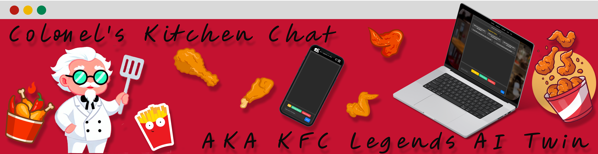

<div align="center">
  
  

# Colonel's Kitchen Chat(AKA **KFC Legends AI Twin**)

### An AI-powered chatbot running on a GaiaNet AI node, featuring a lively and interactive Colonel Sanders twin—experience personalized cooking tips, legendary recipes, and timeless wisdom, all through the power of decentralized AI technology!

  <p align="center">
    <a href="#project-overview">Project Overview</a> •
    <a href="#project-demo">Project Demo</a> •
    <a href="#installation">Installation</a> •
    <a href="#future-enhancements">Future Enhancements</a> •
    <a href="#license">License</a>
  </p>
</div>

## Project Overview

**Colonel's Kitchen Chat** (also known as the **KFC Legends AI Twin**) delivers an immersive and interactive experience. Imagine chatting with an AI-powered Colonel Sanders to discover his world-famous recipes, gain inspiration from his entrepreneurial journey, and explore fun and engaging interactions along the way.

### Key Features:

- **Real-Time Conversations**: Engage directly with an AI version of Colonel Sanders. Ask him about his secret recipes, cooking techniques, and receive wisdom from his journey to success.
- **Personalized Cooking Tips & Legendary Recipes**: Get direct access to KFC-inspired recipes and cooking advice, offering a new culinary adventure with every interaction.
- **Daily Wisdom**: The Colonel shares his life lessons, mixing humor with wisdom to motivate and inspire you daily.

## Project Demo

### Watch the Video or Try the Live Demo

[](https://www.youtube.com/watch?v=sMddHJ5waag)

[Watch the demo](https://www.youtube.com/watch?v=sMddHJ5waag) or [try the live version](https://jackychung2003.github.io/colonels-kitchen-chat/) of **Colonel's Kitchen Chat**.

### Screenshots

- **Chat Interface**  
  

- **404 Page Torchlight Effect**  
  

## Installation

Follow these steps to set up the project locally:

### Clone the Repository

```bash
git clone https://github.com/JackyChung2003/colonels-kitchen-chat.git
cd colonels-kitchen-chat
```

### Install Dependencies

```bash
npm install
```

### Environment Setup

To connect the app to the GaiaNet AI node or other AI services, set up the necessary environment variables.

Create a `.env` file in the root directory with the following content:

```bash
VITE_GAIANET_NODE_ID=your-gaianet-node-id
```

### Run the Application

```bash
npm run dev
```

The app will now run locally, and you can access it in your browser at `http://localhost:5173/colonels-kitchen-chat/`.

### Future Enhancements

Looking to the future, the following features are planned:

- **Gamification**: Add leaderboards and achievements for users who engage with the Colonel the most.
- **Community Features**: Allow users to share recipes, rate them, and connect with other food lovers.
- **Special Events**: Host monthly themed events and challenges to keep the experience fresh and exciting.

## License

This project is licensed under the GNU General Public License v3.0. See the [LICENSE](LICENSE) file for more details.

GPL-3.0 © [Jacky Chung](https://github.com/JackyChung2003)
